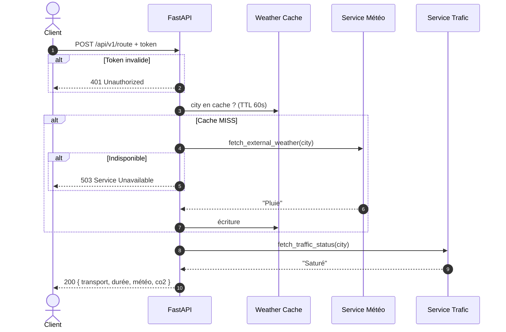

# Diagramme de séquence — POST /api/v1/route

```mermaid
sequenceDiagram
    autonumber
    actor Client
    participant API as FastAPI
    participant Cache as Weather Cache
    participant Meteo as Service Météo
    participant Trafic as Service Trafic

    Client->>API: POST /api/v1/route + token
    alt Token invalide
        API-->>Client: 401 Unauthorized
    end

    API->>Cache: city en cache ? (TTL 60s)
    alt Cache MISS
        API->>Meteo: fetch_external_weather(city)
        alt Indisponible
            API-->>Client: 503 Service Unavailable
        end
        Meteo-->>API: "Pluie"
        API->>Cache: écriture
    end

    API->>Trafic: fetch_traffic_status(city)
    Trafic-->>API: "Saturé"

    API-->>Client: 200 { transport, durée, météo, co2 }
```
